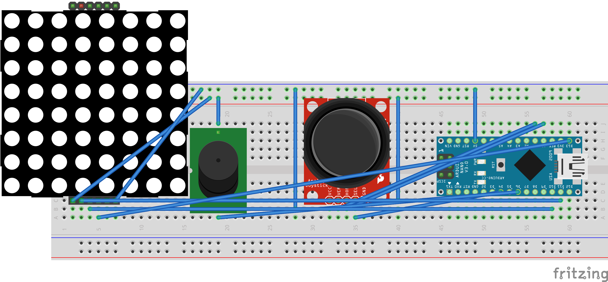

# Pong Game on 8x8 LED Matrix with Arduino Nano

🎮 Classic Pong, miniaturized!  
Control the paddle using a joystick while an AI opponent challenges you on an 8x8 LED display. This project is built using an Arduino Nano, joystick, buzzer, and LED matrix.

---

## 🧩 Components

| Component         | Description              |
|------------------|--------------------------|
| Arduino Nano      | Main controller          |
| MAX7219 8x8 Matrix| Game display             |
| Joystick Module   | Paddle control           |
| Buzzer            | Sound effects            |
| Jumper Wires      | Connections              |
| Breadboard        | Optional for testing     |

---

## 🔌 Wiring Diagram

---

## 🕹️ Controls

- Move paddle up/down using the joystick
- Ball bounces off paddles and walls
- If the player or AI misses, ball resets
- Buzzer sounds for collisions and goals

---

## 📂 Files

- `pong_game.ino` – Main Arduino sketch
- `wiring.png` – Fritzing circuit diagram
- `README.md` – This file

---

## 🧠 Built With

- [Arduino IDE](https://www.arduino.cc/en/software)
- [LedControl Library](https://github.com/wayoda/LedControl)
- A ton of patience and nostalgia

---

## 📺 Demo Video

Check out the YouTube video [here](https://youtube.com)!

---

## 🚀 Next Ideas

- Add score tracking
- Display score on a second matrix
- Add pause/start button
- 2-player mode

---

Made with ❤️ and a joystick.

